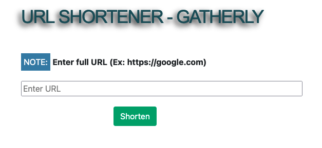

# gatherly
Gatherly Short URL

## Dependecies:
       * "concurrently": "^6.3.0",
       * "config": "^3.3.6",
       * "cors": "^2.8.5",
       * "express": "^4.17.1",
       * "mongoose": "^6.0.10",
       * "shortid": "^2.2.16",
       * "valid-url": "^1.0.9"
       * "nodemon": "^2.0.13"
    
## Run the application:
    access the back-end folder 
        -> npm run dev   //this will trigger the front-end and back-end ports
        
        
## Issues:
    Keep getting a "Unauthrized Error" when trying to communicate from front-end to back-end
    I manage to get the long URLS to a small ones and saved them in a MongoDB through the back-end
    Front-end does pass the website value but would not trigger the database, I tried multiple ways to communicate from both ports but was unsuccessful. I managed to print the new shorten URL in the command line when passing the value. 

### Front-End
 

### Terminal

### Web-Console
 
